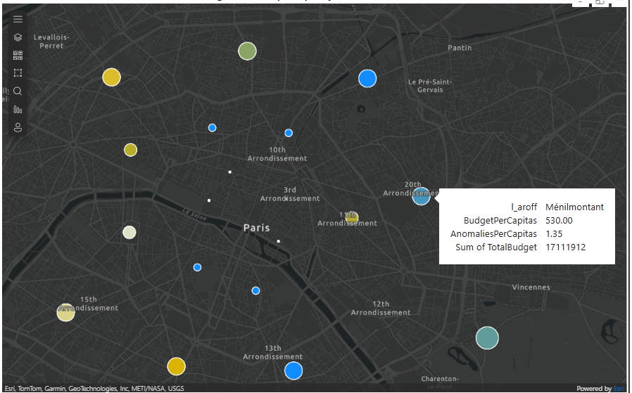
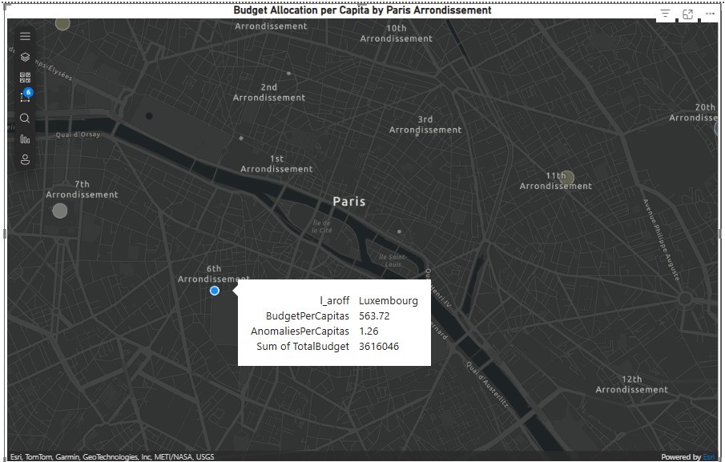
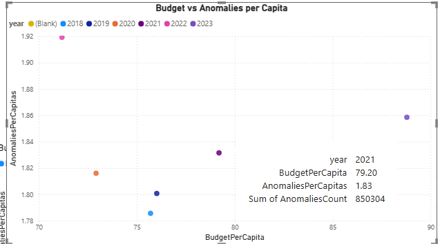
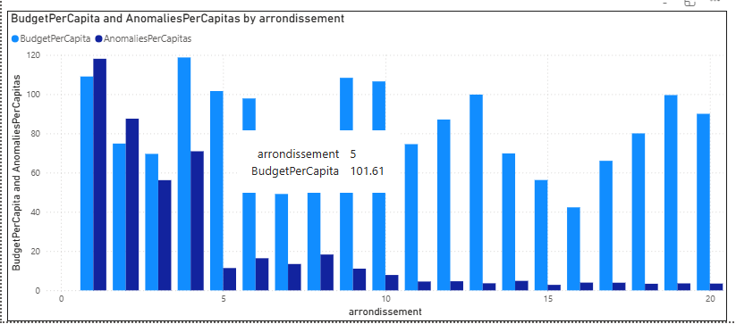
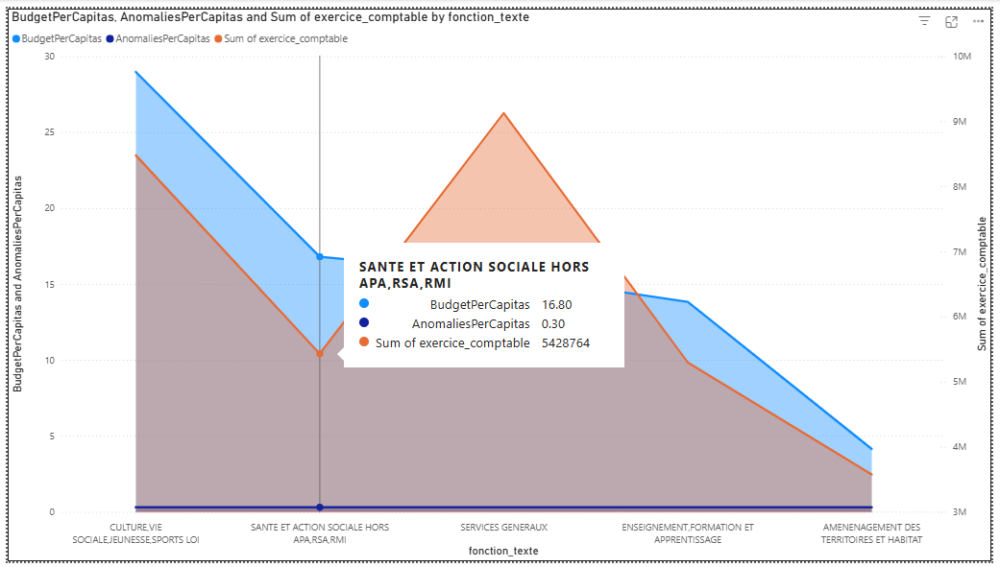
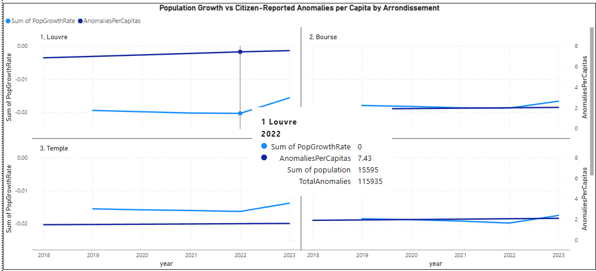
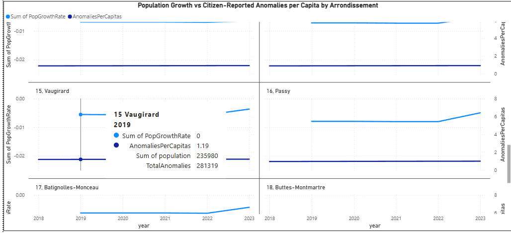

# Paris Open Data Analysis Report

## 1. Data Collection

I went to the **Open Data Paris** website and searched for relevant datasets to work on.  

- I was not able to find a single dataset that could give me valuable insights on its own.  
- So I decided to combine **multiple datasets**:  

1. **Dans Ma Rue** – citizen-reported anomalies.  
   - Downloaded as CSV.  

2. **Budgets votés - États Spéciaux d’Arrondissements à partir de 2018** – Paris budget data.  
   - Fetched using API.  

3. **Arrondissement Geo Data** – geographical data for Paris districts.  
   - Fetched using API.  

4. **Population Dataset** – population per arrondissement.  
   - This data was generated based on previous data because no public record exists.

---

## 2. Data Cleaning and Preparation

- Explored the datasets to understand structure and content.  
- Cleaned column names, fixed uppercase/lowercase issues, removed unnecessary characters.  
- Created a **MySQL database** with 4 tables (one for each dataset).  
- Connected Power BI directly to the MySQL database to fetch the data.

---

## 3. Data Modeling in Power BI

- Created relationships between tables using **arrondissement number**.  
- This allowed me to calculate per capita measures and correlate different datasets.  

---

## 4. Analysis and Visualizations

### 4.1 ArcGIS Map – Budget Allocation per Capita by Paris Arrondissement

**Why this is important:**  
- Shows which districts receive more budget relative to their population.  
- Helps to understand spatial distribution of resources.  
- Highlights potential underfunded areas.  

---

### 4.2 Budget vs Anomalies per Capita (2018–2023)

**Why this is important:**  
- Compares **budget allocation per capita** with **citizen-reported anomalies per capita**.  
- Helps identify if higher budgets lead to fewer problems.  
- Can reveal inefficiencies or misaligned spending.  

---

### 4.3 Budget and Anomalies per Capita by Arrondissement & Fonction

**Why this is important:**  
- Combines **budget per capita**, **anomalies per capita**, and **budget breakdown by fonction_texte**.  
- Helps analyze which types of spending (social, infrastructure, maintenance) are most effective.  
- Reveals correlations between functional spending and reported issues.  

---

### 4.4 Population Growth vs Citizen-Reported Anomalies per Capita by Arrondissement

**Why this is important:**  
- Shows how **population growth** in an arrondissement impacts the number of anomalies reported per capita.  
- Highlights districts where rapid population increase may stress city services.  
- Helps prioritize future budget allocations to mitigate issues.

---

## 5. Summary

- Used **multiple datasets** to generate meaningful insights.  
- Linked **budget, population, anomalies, and geography** in Power BI.  
- Built interactive visualizations to explore trends over **time, space, and function**.  
- Identified correlations and highlighted potential areas for better resource allocation.

---